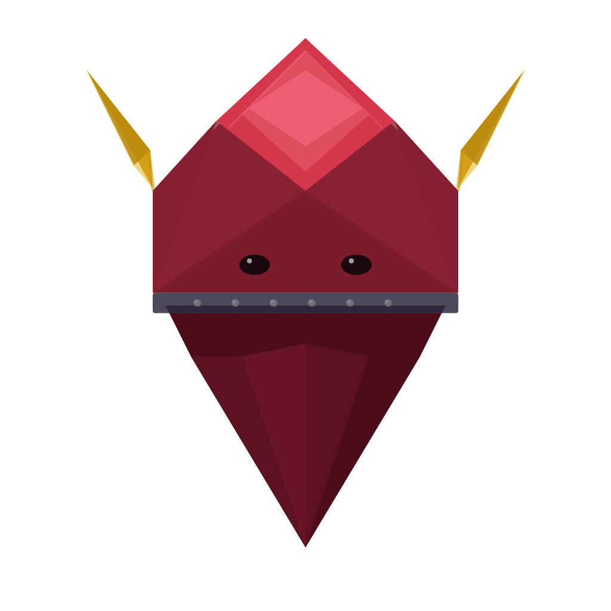

# Raider Desktop

<!-- PROJECT LOGO -->
<br />
<div align="center">
   <a href="https://github.com/RaiderHQ/ruby_raider">
   
   </a>

   <h3>The Desktop Companion for Ruby Raider</h3>

   <p align="center">
      <a href="https://ruby-raider.com/">Website</a>
      ·
      <a href="https://github.com/RaiderHQ/raider_desktop/releases">Downloads</a>
      ·
      <a href="https://github.com/RaiderHQ/raider_desktop/issues">Report Bug</a>
      ·
      <a href="https://github.com/RaiderHQ/raider_desktop/issues">Request Feature</a>
   </p>
</div>

<br />

> [!WARNING]
> Raider Desktop is currently available for **macOS only**. Windows and Linux builds are generated via CI but are not yet fully tested.

Raider Desktop is the UI companion for [Ruby Raider](https://github.com/RaiderHQ/ruby_raider) — a Ruby test automation framework. It provides an intuitive interface for creating projects, recording tests, editing code, running suites, and viewing results, all without needing to touch the command line.

## Table of Contents

- [For Users](#for-users)
  - [Prerequisites](#prerequisites)
  - [Features](#features)
  - [Common Errors](#common-errors)
- [For Developers](#for-developers)
  - [Tech Stack](#tech-stack)
  - [Getting Started](#getting-started)
  - [Testing](#testing)
  - [CI/CD](#cicd)
  - [Building](#building)

---

## For Users

### Prerequisites

- [**rbenv**](https://github.com/rbenv/rbenv) with **Ruby 3.0.0+** installed
- The [**ruby_raider**](https://github.com/RaiderHQ/ruby_raider) gem (`gem install ruby_raider`)

If these are missing, the app will show a setup guide on launch.

### Features

#### Project Management

- **Create new projects** — Pick your automation framework (Selenium, Watir, Capybara) and test framework (RSpec, Cucumber, Minitest), and a full project structure is generated for you
- **Open existing projects** — Load any Ruby Raider project and browse its file tree
- **Adopt non-Raider projects** — Convert an existing Ruby test project into a Ruby Raider project

#### Test Screen

The main hub for working with your project, organized into tabs:

| Tab | What it does |
|-----|-------------|
| **Files** | Browse and edit project files with the built-in Monaco editor |
| **Scaffolding** | Generate new specs, page objects, and helpers |
| **Dashboard** | View test results with pass/fail stats, pie charts, and accessibility violation reports |
| **Settings** | Configure browser options, timeouts, viewport, mobile capabilities, and file paths |

The **toolbar** at the top of the Files tab gives you quick access to:
- **Base URL** — Set the URL your tests navigate to
- **Browser** — Chrome, Safari, Firefox, or Edge
- **Headless mode** — Toggle on/off
- **Viewport presets** — Desktop (1920×1080), Tablet (768×1024), Mobile (375×812)
- **Run mode** — All tests, smoke, regression, or custom tags
- **Integrated terminal** — Run commands without leaving the app

#### Recorder

Record user interactions in an embedded browser and generate test scripts automatically:

- **Embedded browser** — Records clicks, navigation, and form inputs directly inside the app
- **Dual view** — Toggle between human-readable "Friendly View" and generated "Code View"
- **Trace timeline** — Visual timeline of each recorded step with screenshot thumbnails
- **Suite management** — Create, delete, and organize test suites and individual tests
- **Import/Export** — Share tests, suites, or entire projects

#### Test Execution

- Run individual tests, full suites, or re-run only failed tests
- View structured output with pass/fail indicators
- Accessibility violation reports parsed from axe-core output with severity badges and fix suggestions

### Common Errors

<details>
<summary><strong>"rbenv not found"</strong></summary>

Install rbenv:

```bash
# macOS
brew install rbenv

# Then initialize
rbenv init
```

Follow the instructions to add rbenv to your shell config (`.zshrc`, `.bash_profile`).
</details>

<details>
<summary><strong>Permission Denied</strong></summary>

```bash
sudo chown -R $(whoami) /path/to/your/project/folder
```
</details>

<details>
<summary><strong>macOS: "App cannot be opened because the developer cannot be verified"</strong></summary>

1. Open **System Settings** → **Privacy & Security**
2. Click **"Open Anyway"** next to the Ruby Raider message
3. Click **"Open"** in the confirmation dialog

You only need to do this once.
</details>

---

## For Developers

### Tech Stack

| Layer | Technology |
|-------|-----------|
| Framework | Electron + electron-vite |
| Language | TypeScript (strict) |
| Frontend | React 18 + Tailwind CSS |
| Editor | Monaco Editor |
| Terminal | xterm.js + node-pty |
| State | Zustand |
| Testing | Vitest (unit) + Playwright (E2E) |
| Build | electron-builder |
| CI/CD | GitHub Actions |

### Getting Started

**Requirements:** Node.js 20+, Ruby 3.0.0+ via rbenv, `ruby_raider` gem

```bash
git clone https://github.com/RaiderHQ/raider_desktop.git
cd raider_desktop
npm install
npm run dev
```

### Testing

```bash
# Unit tests
npm test

# E2E tests
npm run test:e2e

# Type checking
npm run typecheck
```

### CI/CD

GitHub Actions runs automatically:

- **On PRs to `main`**: Unit tests + typecheck + smoke builds (`test.yml`, `build-test.yml`)
- **On tag push (`v*`)**: Full cross-platform builds (macOS ARM + Intel, Windows, Linux) → GitHub Release with downloadable artifacts (`release.yml`)

To create a release, tag a commit and push:

```bash
git tag v3.0.0
git push origin v3.0.0
```

The pipeline will build all platforms and create a GitHub Release at `https://github.com/RaiderHQ/raider_desktop/releases/tag/v3.0.0` with direct download links for each artifact.

### Building

```bash
npm run build:mac     # macOS (.dmg)
npm run build:win     # Windows (.exe)
npm run build:linux   # Linux (.AppImage, .deb)
```
